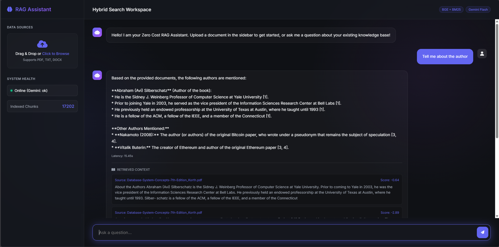
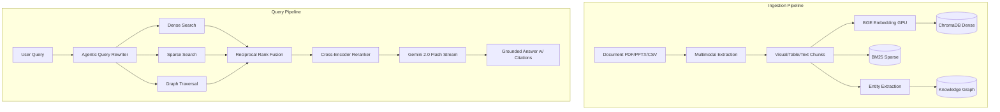

<div align="center">
  <h1>🧠 Hybrid Search RAG Pipeline</h1>
  <p><i>An enterprise-grade, fully zero-cost Retrieval-Augmented Generation (RAG) system built with FastAPI, ChromaDB, and Google Gemini.</i></p>

  [](https://python.org)
  [](https://fastapi.tiangolo.com)
  [](https://docker.com)
  [](#)
</div>

---

## 📖 Overview

The **Ultimate RAG Pipeline** is a highly optimized, scalable backend designed to allow users to upload massive documents and query them naturally. It goes far beyond standard vector search by implementing **Multimodal RAG** (processing tables, charts, and diagrams), a **Knowledge Graph** (GraphRAG) for multi-hop reasoning, and an **Agentic Self-Correcting Loop** to ensure perfectly grounded answers.

Best of all, this entire stack is designed to be **Zero-Cost**—leveraging powerful open-source local models for embeddings and reranking, alongside Google's free-tier Gemini 2.0 Flash API for generation, vision, and extraction.

## 📸 Web Interface

*(Place a screenshot of your beautiful dark-mode UI here! Save it as `ui-screenshot.png` in an `assets` folder)*


## ✨ Key Features

- **📊 Multimodal RAG**: Uses Gemini Vision and pdfplumber to extract and index charts, diagrams, and tables as first-class searchable chunks.
- **🕸️ GraphRAG**: Automatically builds a Knowledge Graph of entity-relationship triples during ingestion for global multi-hop reasoning.
- **🤖 Agentic Self-Correction**: If the LLM doesn't find the answer, it autonomously rewrites your query and searches again to ensure groundedness.
- **🧠 Contextual Chunking**: Text chunks are prepended with document and page-level metadata for massive precision boosts.
- **💬 Conversation Memory**: Remembers chat history so you can ask follow-up questions naturally.
- **🌐 Streaming Responses**: Streams tokens to the UI in real-time via Server-Sent Events (SSE).
- **⚡ Blazing Fast Ingestion**: Supports PDF, DOCX, PPTX, CSV, Excel, HTML, and Markdown.
- **🔍 Hybrid Retrieval System**: Combines semantic understanding (Dense via `bge-base`) with exact keyword matching (Sparse via `BM25`).
- **🎯 Advanced Reranking**: Uses a cross-encoder to re-score and perfectly order retrieved contexts.

## 🏗️ Architecture

## 🏗️ Architecture



## 🛠️ Technology Stack

| Component | Technology | Description |
|-----------|------------|-------------|
| **Core API** | FastAPI | High-performance async web framework |
| **Vector DB** | ChromaDB | Open-source vector database |
| **Embeddings** | SentenceTransformers | `BAAI/bge-base-en-v1.5` running locally via PyTorch |
| **Sparse Index** | Rank-BM25 | Keyword-based term frequency indexing |
| **LLM Provider** | Google Gemini | Generative AI and Vision via `gemini-2.0-flash` |
| **Graph DB** | NetworkX | In-memory triple storage |
| **Frontend** | Vanilla JS / CSS | Streaming, document management, chat history |

## 🚀 Getting Started

### Prerequisites
- Docker & Docker Compose
- A [Google Gemini API Key](https://aistudio.google.com/) (Free Tier)
- *(Optional but Recommended)* NVIDIA GPU with Container Toolkit installed for 10x faster embeddings.

### Installation

1. **Clone the repository**:
   ```bash
   git clone https://github.com/yourusername/rag-pipeline-hybrid.git
   cd rag-pipeline-hybrid
   ```

2. **Configure Environment Variables**:
   Copy the example environment file and add your Gemini API Key.
   ```bash
   cp .env.example .env
   # Open .env and set GEMINI_API_KEY=your_actual_key
   ```

3. **Deploy with Docker**:
   ```bash
   docker-compose up --build -d
   ```

### Usage

**Web Interface**
Open your browser and navigate to:
`http://localhost:8080/ui`

**API Endpoints**
- `POST /ingest` - Upload documents (`multipart/form-data`)
- `POST /query` - Ask questions (`{"query": "string"}`)
- `GET /health` - Check system status and component latency

## 🧪 Evaluation & Testing

This project includes a dedicated evaluation suite using the `Ragas` framework to ensure high retrieval accuracy. 

To run the automated tuner and evaluate your pipeline against the golden dataset:
```bash
docker-compose exec api python -m eval.tune
```
Results will be output to the console, detailing scores for context precision, recall, and answer faithfulness.

---
<div align="center">
  <i>Built by Siddham</i>
</div>
