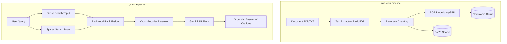

<div align="center">
  <h1>🧠 Hybrid Search RAG Pipeline</h1>
  <p><i>An enterprise-grade, fully zero-cost Retrieval-Augmented Generation (RAG) system built with FastAPI, ChromaDB, and Google Gemini.</i></p>

  [](https://python.org)
  [](https://fastapi.tiangolo.com)
  [](https://docker.com)
  [](#)
</div>

---

## 📖 Overview

The **Hybrid Search RAG Pipeline** is a highly optimized, scalable backend designed to allow users to upload massive documents and query them naturally. Unlike standard RAG systems that rely solely on dense vector search, this project implements a **Hybrid Search Architecture** (combining Dense and Sparse retrieval) with a **Cross-Encoder Reranker**, ensuring unparalleled accuracy and context retrieval. 

Best of all, this entire stack is designed to be **Zero-Cost**—leveraging powerful open-source local models for embeddings and reranking, alongside Google's free-tier Gemini API for generation.

## ✨ Key Features

- **⚡ Blazing Fast Ingestion**: Utilizes `PyMuPDF` and asynchronous thread pools to parse and embed massive textbooks (1000+ pages) in seconds without blocking the API.
- **🔍 Hybrid Retrieval System**: Combines semantic understanding (Dense Vector Search via `BAAI/bge-base-en-v1.5`) with exact keyword matching (Sparse Search via `BM25`).
- **🎯 Advanced Reranking**: Uses a cross-encoder (`ms-marco-MiniLM-L-6-v2`) to re-score and perfectly order retrieved contexts before they reach the LLM.
- **🤖 Grounded Generation**: Powered by **Google Gemini 3.5 Flash**, the system strictly answers based on retrieved context and automatically provides inline citations mapping back to the source document.
- **📊 Integrated Evaluation Engine**: Built-in automated evaluation pipeline using `Ragas` to score Faithfulness, Answer Relevancy, Context Precision, and Context Recall.
- **🖥️ Clean Web UI**: A sleek, dark-mode web interface for seamless drag-and-drop document uploading and real-time chat interactions.

## 🏗️ Architecture



## 🛠️ Technology Stack

| Component | Technology | Description |
|-----------|------------|-------------|
| **Core API** | FastAPI | High-performance async web framework |
| **Vector DB** | ChromaDB | Open-source vector database |
| **Embeddings** | SentenceTransformers | `BAAI/bge-base-en-v1.5` running locally via PyTorch |
| **Sparse Index** | Rank-BM25 | Keyword-based term frequency indexing |
| **LLM Provider** | Google Gemini | Generative AI via `models/gemini-3.5-flash` |
| **Frontend** | Vanilla JS / CSS | Lightweight, responsive interface |

## 🚀 Getting Started

### Prerequisites
- Docker & Docker Compose
- A [Google Gemini API Key](https://aistudio.google.com/) (Free Tier)
- *(Optional but Recommended)* NVIDIA GPU with Container Toolkit installed for 10x faster embeddings.

### Installation

1. **Clone the repository**:
   ```bash
   git clone https://github.com/yourusername/rag-pipeline-hybrid.git
   cd rag-pipeline-hybrid
   ```

2. **Configure Environment Variables**:
   Copy the example environment file and add your Gemini API Key.
   ```bash
   cp .env.example .env
   # Open .env and set GEMINI_API_KEY=your_actual_key
   ```

3. **Deploy with Docker**:
   ```bash
   docker-compose up --build -d
   ```

### Usage

**Web Interface**
Open your browser and navigate to:
`http://localhost:8080/ui`

**API Endpoints**
- `POST /ingest` - Upload documents (`multipart/form-data`)
- `POST /query` - Ask questions (`{"query": "string"}`)
- `GET /health` - Check system status and component latency

## 🧪 Evaluation & Testing

This project includes a dedicated evaluation suite using the `Ragas` framework to ensure high retrieval accuracy. 

To run the automated tuner and evaluate your pipeline against the golden dataset:
```bash
docker-compose exec api python -m eval.tune
```
Results will be output to the console, detailing scores for context precision, recall, and answer faithfulness.

---
<div align="center">
  <i>Built with ❤️ by Siddham</i>
</div>
